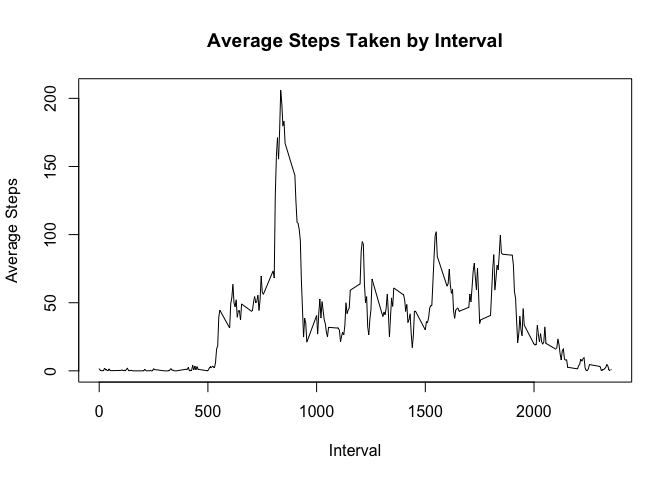
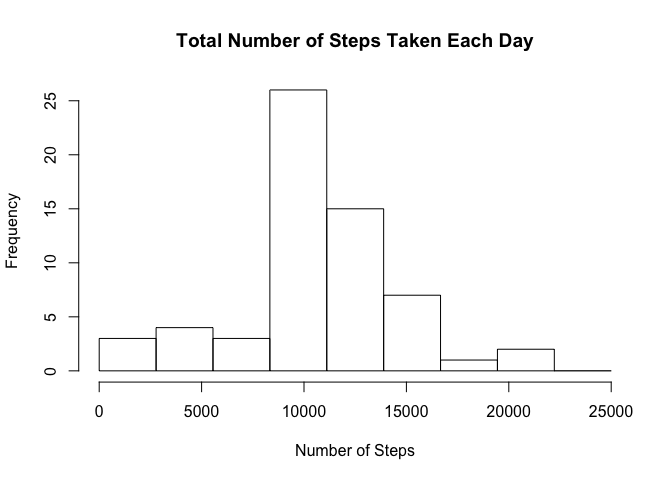

# Reproducible Research: Peer Assessment 1
Julia Borman  
June, 2016  

## About

This assignment makes use of data from a personal activity monitoring device. This device collects data at 5 minute intervals through out the day. The data consists of two months of data from an anonymous individual collected during the months of October and November, 2012 and include the number of steps taken in 5 minute intervals each day.

Assignment desciption, markdown template, relevant README files and data are available on the [GitHub repository created for this assignment](https://github.com/rdpeng/RepData_PeerAssessment1).

## Data

The data for this assignment can also be downloaded from the course web
site:

* Dataset: [Activity monitoring data](https://d396qusza40orc.cloudfront.net/repdata%2Fdata%2Factivity.zip)

The variables included in this dataset are:

* **steps**: Number of steps taking in a 5-minute interval (missing
    values are coded as `NA`)

* **date**: The date on which the measurement was taken in YYYY-MM-DD
    format

* **interval**: Identifier for the 5-minute interval in which
    measurement was taken

## Loading and preprocessing the data
First, we need to load the data and then process/transform these data into a format suitable for the analysis below.

#### Bring in data
Load data into dataframe `data`


```r
if(!file.exists('activity.csv')){
   unzip('activity.zip')
}
data<-read.csv("activity.csv", stringsAsFactors = F)
data$date<-as.Date(data$date)
```

## What is mean total number of steps taken per day?
For this part of the assignment, we ignore the missing values in the dataset.

#### Calculate the total number of steps taken per day

```r
stepsbyday<-unlist(lapply(split(data, data$date), function(x){sum(x$steps, na.rm=T)}))
```

#### Make a histogram of the total number of steps taken each day

```r
hist(stepsbyday, main='Total Number of Steps Taken Each Day', xlab='Number of Steps', breaks=seq(0, 25000, length.out = 10))
```

<!-- -->

#### Calculate and report the mean and median of the total number of steps taken per day

```r
mean.stepsbyday<-mean(stepsbyday)
median.stepsbyday<-median(stepsbyday)
```
The mean total number of steps taken per day is 9354.23, and the median of total steps per day is 10395.

## What is the average daily activity pattern?
We look at the average number of steps taken for each 5 minute interval over all days and see which contains the maximum number of steps.

#### Time series plot of the 5-minute interval and the average number of steps taken, averaged across all days.

```r
avg.steps.byinterval<-unlist(lapply(split(data, data$interval), function(x){mean(x$steps, na.rm=T)}))
plot(x=unique(data$interval), y=avg.steps.byinterval, main='Average Steps Taken by Interval', type='l', xlab='Interval', ylab='Average Steps')
```

<!-- -->

#### Which 5-minute interval, on average across all the days in the dataset, contains the maximum number of steps?

```r
indx<-which(avg.steps.byinterval==max(avg.steps.byinterval))
int<-names(avg.steps.byinterval)[indx]
val<-avg.steps.byinterval[indx]
```
The maximum average steps by interval occurs in the 835 interval, with an average of 206.1698113 steps.

## Imputing missing values

<!-- Note that there are a number of days/intervals where there are missing values (coded as 𝙽𝙰). The presence of missing days may introduce bias into some calculations or summaries of the data. -->

#### Calculate and report the total number of missing values in the dataset (i.e. the total number of rows with 𝙽𝙰s)

```r
toimpute <- (which(is.na(data$steps)))
```
There are 2304 days/intervals where there are missing step values. This may introduce bias into calculations or summaries of the data.

#### Devise a strategy for filling in all of the missing values in the dataset. 
The strategy for imputation will be to use the average for the 5 minute interval.

```r
indx<-match(data$interval[toimpute], names(avg.steps.byinterval))
```

#### Create a new dataset that is equal to the original dataset but with the missing data filled in.

```r
newdata<-data
newdata$steps[toimpute]<-avg.steps.byinterval[indx]
```

#### Make a histogram of the total number of steps taken each day and Calculate and report the mean and median total number of steps taken per day. Do these values differ from the estimates from the first part of the assignment? What is the impact of imputing missing data on the estimates of the total daily number of steps?

```r
newstepsbyday<-unlist(lapply(split(newdata, newdata$date), function(x){sum(x$steps, na.rm=T)}))
hist(newstepsbyday, main='Total Number of Steps Taken Each Day', xlab='Number of Steps', breaks=seq(0, 25000, length.out = 10))
```

<!-- -->

```r
mean.newstepsbyday<-mean(newstepsbyday)
median.newstepsbyday<-median(newstepsbyday)

diffmean<-round(mean.newstepsbyday-mean.stepsbyday, digits=2)
diffmedian<-round(median.newstepsbyday-median.stepsbyday, digits=2)
```
The new data, with imputed values for steps where there were previously missing values, has a mean of 1.076619\times 10^{4} and a median of 1.076619\times 10^{4}. 

The difference in the mean of the new and original data is 1411.96. The difference in the median of the new and original data is 371.19. 

The overall impact of imputing missing data by using the average steps for that inveral is that the mean and median both increase, and the median moves closer to the mean value.

## Are there differences in activity patterns between weekdays and weekends?


#### Create a new factor variable in the dataset with two levels – “weekday” and “weekend” indicating whether a given date is a weekday or weekend day.

```r
checkweekday<-function(x){
  if(weekdays(x) %in% c('Saturday', 'Sunday')){return('weekend')}
  return('weekday')
}
newdata$weekday<-as.factor(sapply(newdata$date, checkweekday))
```


#### Make a panel plot containing a time series plot of the 5-minute interval (x-axis) and the average number of steps taken, averaged across all weekday days or weekend days (y-axis).

```r
library(lattice)
df<-aggregate(steps ~ interval + weekday, newdata, mean)

xyplot(steps~interval | weekday, data = df,
      type = 'l',
      xlab = 'Interval',
      ylab = 'Number of Steps',
      layout = c(1,2))
```

<!-- -->

